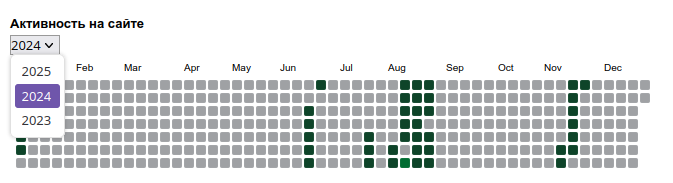
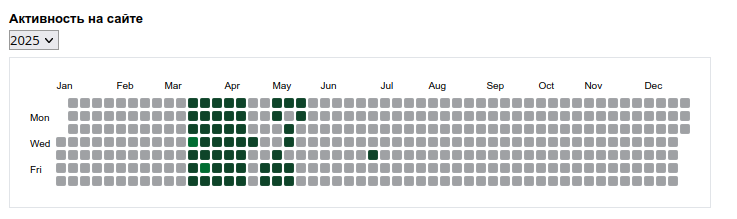
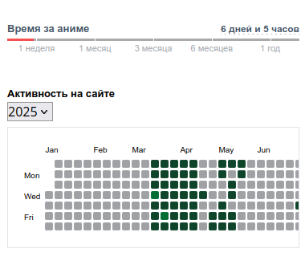

# Shikimori Activity Table
Adds an activity table to Shikimori

## Install
### Firefox Addons

### Tampermonkey

## Screenshots
|Activity on the site|
|--------------------|
|   |

|Activity on the site by year|
|----------------------------|
|           |

|If the site width is more than 1310px|
|-------------------------------------|
|                    |

|Adaptation for the mobile version of the site|
|---------------------------------------------|
|                           |

